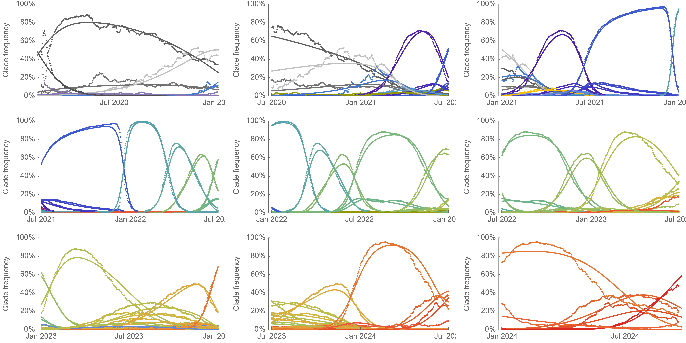
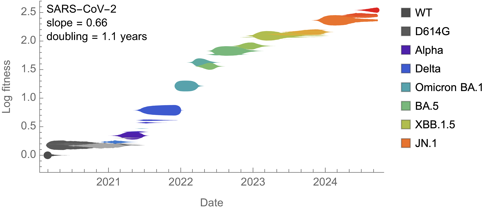
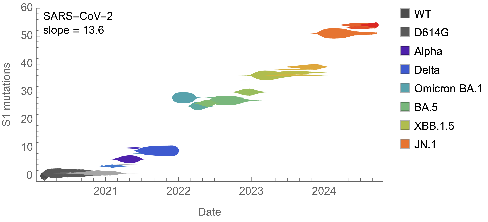
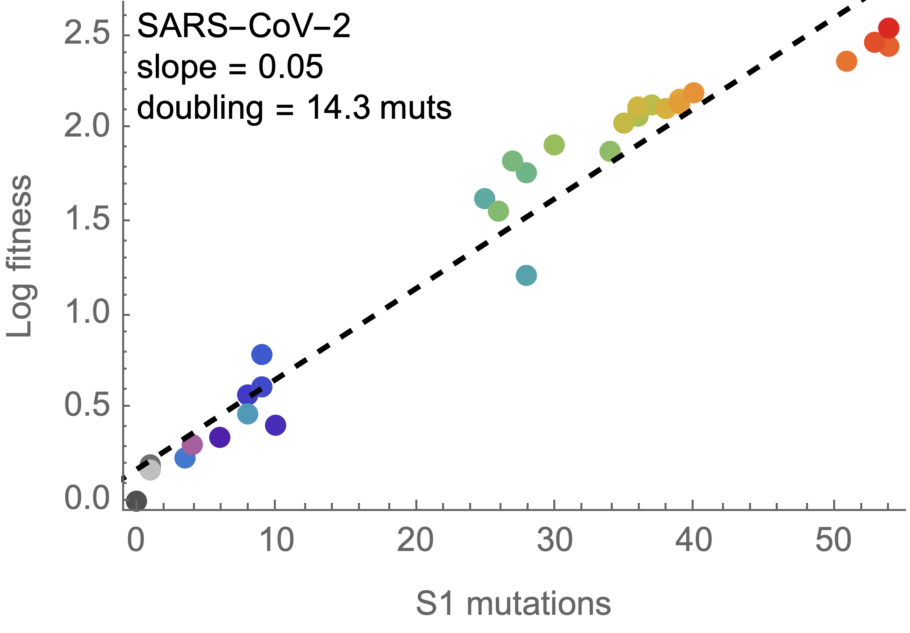
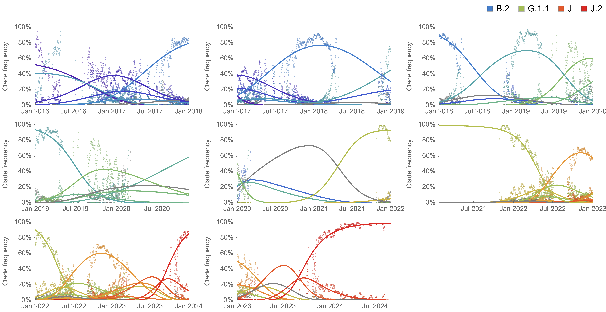
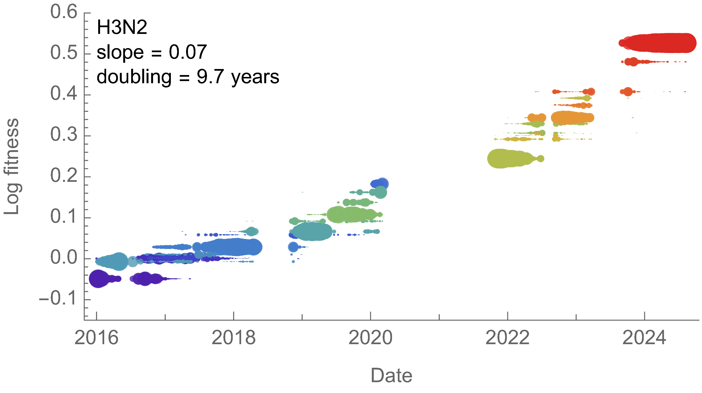
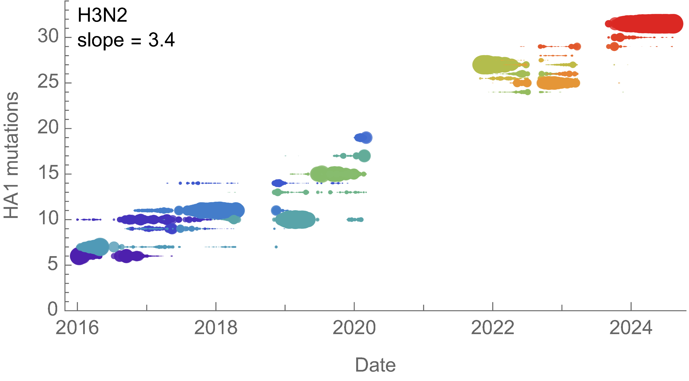
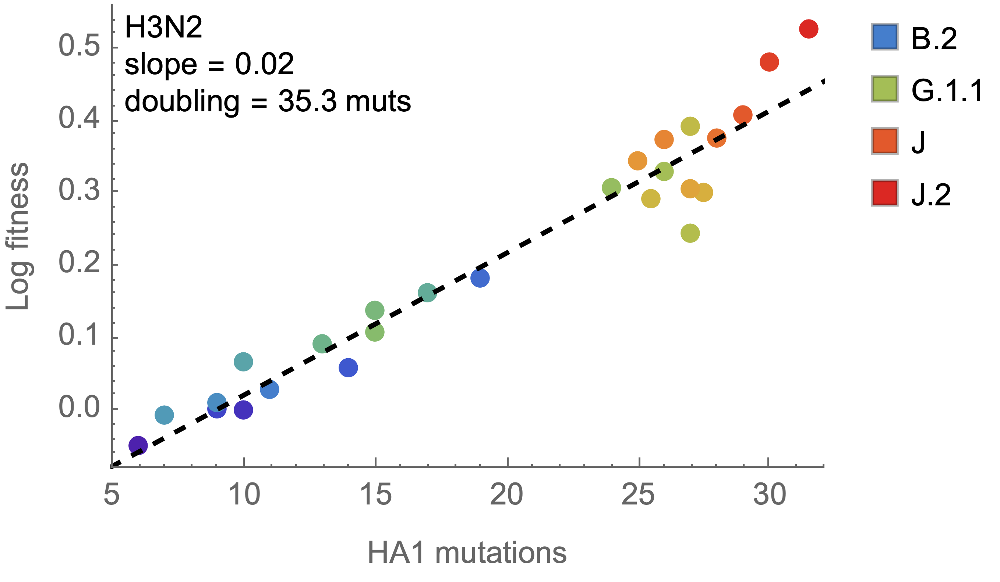

# Analysis of fitness dynamics

## SARS-CoV-2

### Empirical frequencies vs MLR modeled frequencies

### Time vs MLR fitness

### Time vs S1 mutation count

### S1 mutation count vs MLR fitness

## H3N2

### Empirical frequencies vs MLR modeled frequencies

### Time vs MLR fitness

### Time vs S1 mutation count

### S1 mutation count vs MLR fitness

