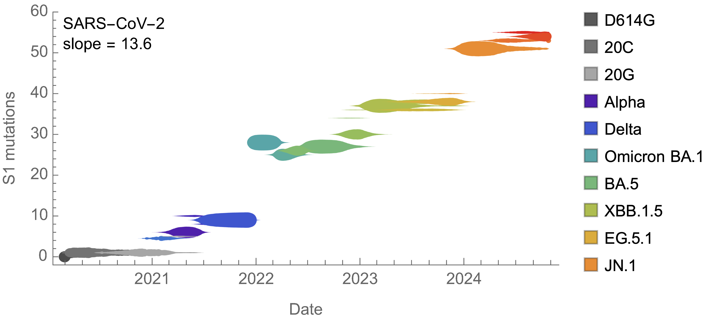
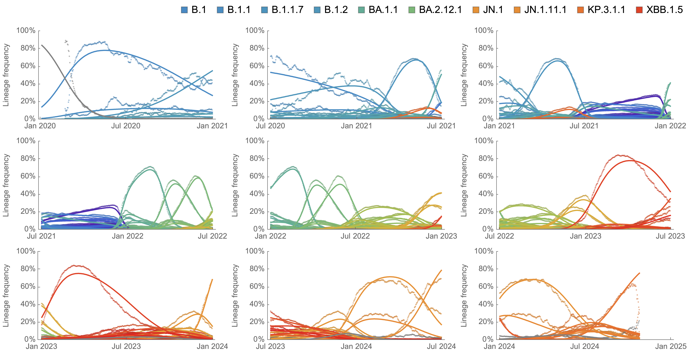
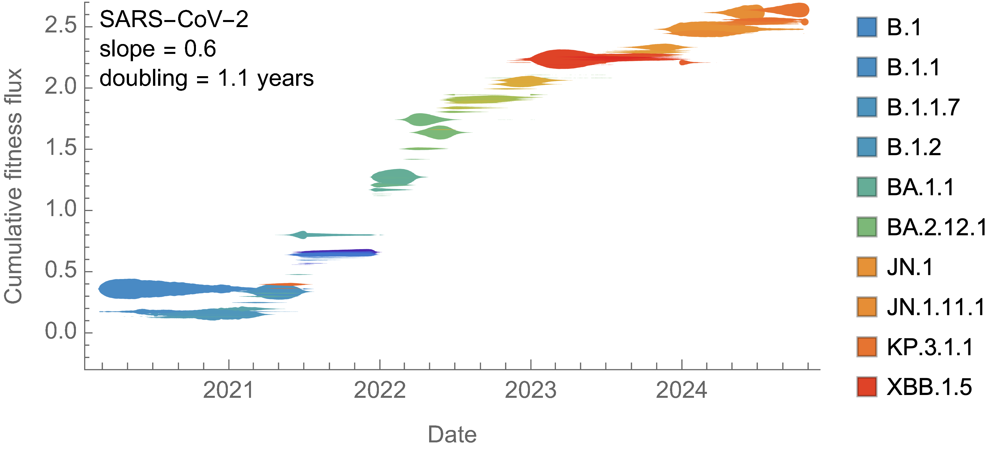
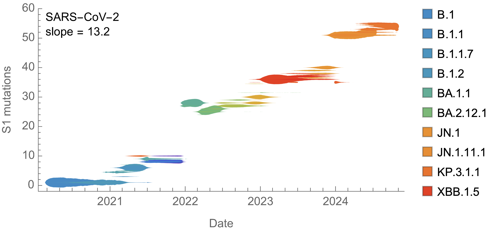
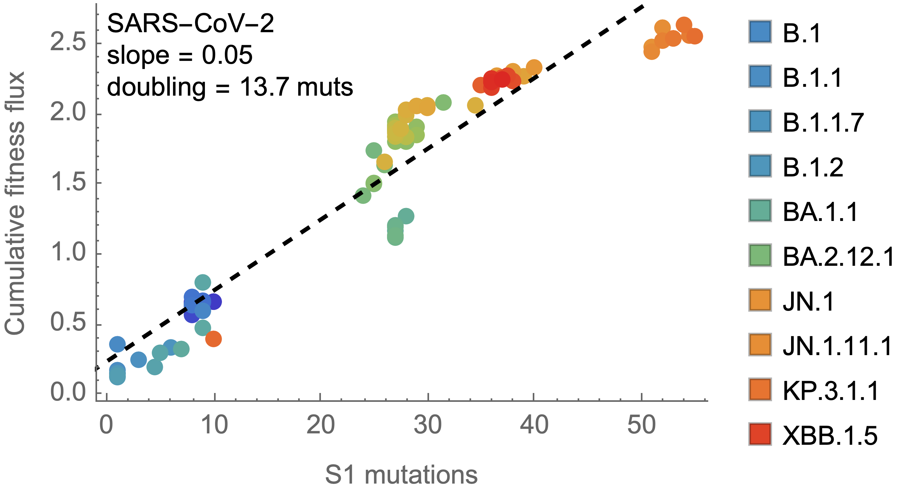

# Analysis of fitness dynamics

## Prep

Run `nextstrain remote download https://nextstrain.org/ncov/gisaid/global/all-time` to produce `ncov_gisaid_global_all-time.json`.

## SARS-CoV-2 clades

### Empirical frequencies vs MLR modeled frequencies

### Time vs MLR fitness

### Time vs S1 mutation count

### S1 mutation count vs MLR fitness

## SARS-CoV-2 lineages

### Empirical frequencies vs MLR modeled frequencies

### Time vs MLR fitness

### Time vs S1 mutation count

### S1 mutation count vs MLR fitness

## H3N2 clades

### Empirical frequencies vs MLR modeled frequencies

### Time vs MLR fitness

### Time vs S1 mutation count

### S1 mutation count vs MLR fitness

